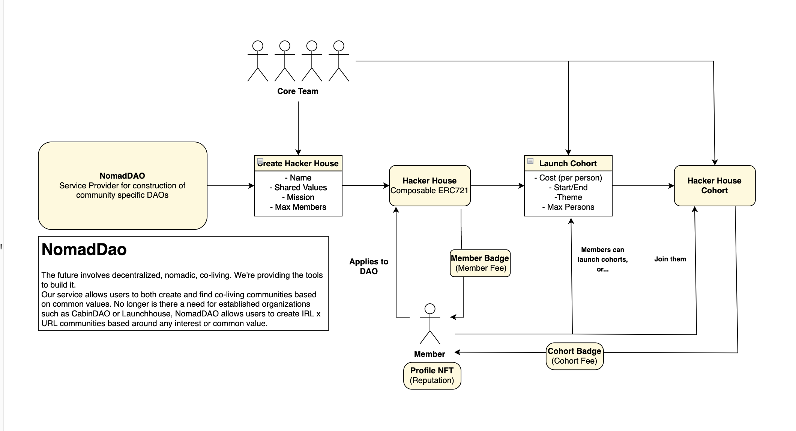
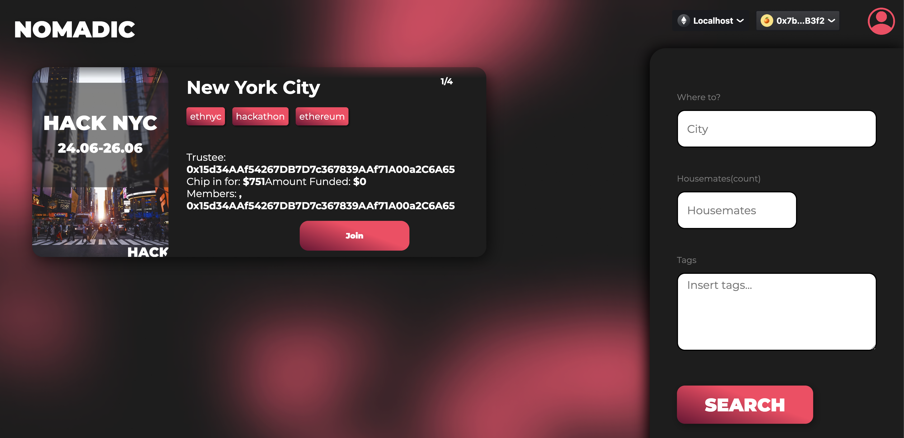
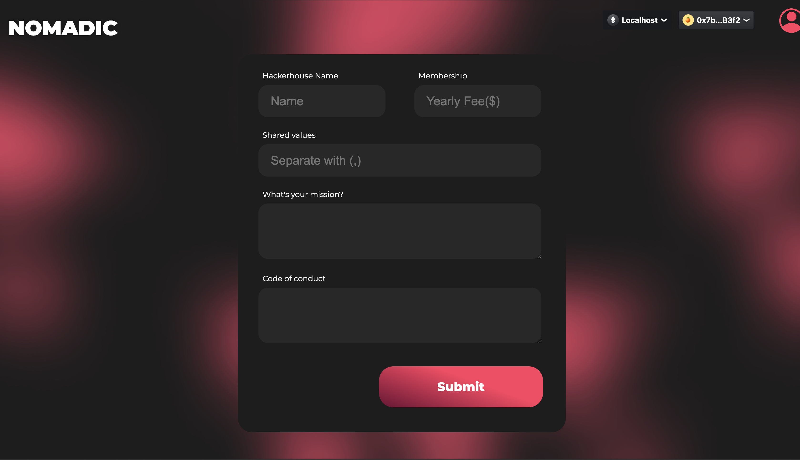
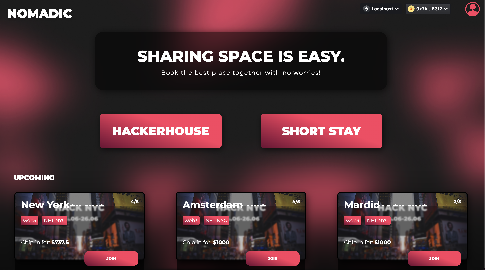
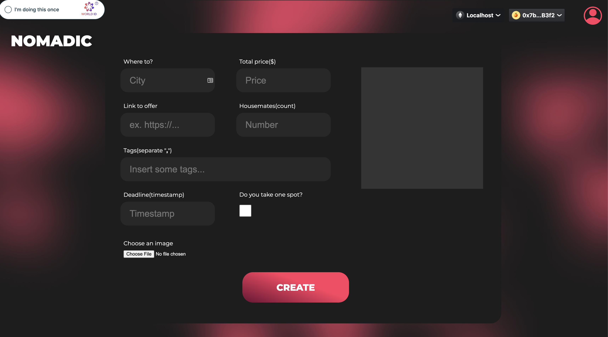

# Nomadic

Nomadic is a decentralized platfoform bringing web3 community together. It makes co-living arrangement process easy, trustless and newcommers friendly.


## Project Description
Nomadic has 2 primary features: creating/finding a short stay and creating/finding a hacker house. We store prove of previous interactions with our platform(communities user belongs to, previous short stays) using on-chain reputation stored in a soulbound NFT. Smart contract is designed to facilitate chipping in for a stay and also a community governance to allow voting decisions within the hacker house. We want to make our platform as secure as possible and for this reason we are using the proof of personhood powered by WorldCoin's identity tech. We used Skale Network to facilitate chipping for a stay, as well as the equal refund of money if something goes wrong with the booking process. The community protocol allows hacker house members to vote on core team ideas.

## How it's Made
Our project uses WalletConnect which makes connecting to our app convenient for our users thanks to QR code pop-up. We wanted to make sure that users who are booking an apartment us or join a hacker house with us are real, and so we used WorldCoin' proof of personhood tech to solve this problem. For deployment we decided to use Polygon and Scale. For storing our updatable NFT metadata we used IPFS.

## Online only on Polygon Mumbai, for testing use locahost [Follow instructions]

## How we use ChainLink
One of the features of Nomadic is allowing users to create short stays and chip in using deadlines for the short stay to be fulfilled, chainlink keeper is used in a crucial way by allowing a check on the deadlines every certain time, this helps to keep the protocol safe and our users funds safe. 

```solidity

        bytes32 _config = config; // Gas savings

        // Have we run today?
        uint256 day = block.timestamp / 86400;
        if (lastRunDay >= day) {
            return (false);
        }

        // Load schedule
        uint8 checkDays = uint8(_config[0]); // day of week bits

        // Weekday
        uint8 weekday = uint8((day + 4) % 7);

        // Need a runCheck?
        if (((checkDays >> weekday) & 1) != 0) {
            runCheck = true;
        }

```
We pass a config bytes that contains in which days we want to run checks, and the keeper will read in low level and perform the operations.
```javascript
 const config = '0x1200000000000000000000000000000000000000000000000000000000000000';
  //00010010 wednesday and saturday 
```
## Future Plans 
We want to use this protocol for an actual idea that we came up in Kuala Lumpur, Malaysia. Planning to extend the use of chainlink keepers for actual hacker houses and long term stays happening around the country.

### POC - (Mumbai)
INFO: Deployed HackerHouseDAO Address: 0xa7b4eD9AD6d29625Ba760759fB8d602E48391246 Gas Used: 1682421
INFO: Deployed NomadicVault Address: 0x44A87247123aFFd23891a43c13E44cb180886F28 Gas Used: 2298533
INFO: Deployed NomadicWorldCoin Address: 0x6BBe1A603bf289F4402E3E13EeBb9cd7051f6f2e Gas Used: 1135598
INFO: Deployed NomadicKeeper Address: 0x029bCcD921039c1F60c0F7A39C2a2fF4eF641f06 Gas Used: 371122

### pitch deck
https://pitch.com/public/6114c484-4c2a-43ce-a8f6-1a9b4be816a5

### Architecture



### Screenshots and Demo





[](https://www.youtube.com/watch?v=pR3nnZf0jBM)

### to run front end locally

clone

`git clone https://github.com/jrcarlos2000/ChainlinkHack`

install dependencies

`cd ./ChainlinkHack/frontend`

`npm i`

run front end locally

`npm run start`


